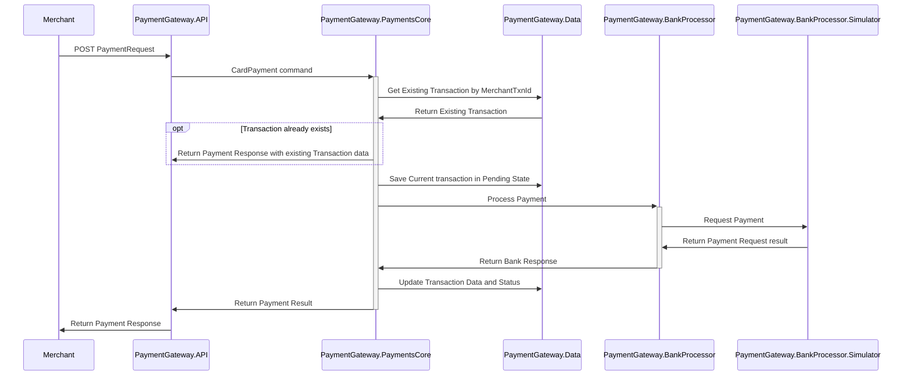

# PaymentGateway Tech Challenge

In this document, I give a brief explanation about how I tackled the test, tech architecture, how you can test the system, and what I would have done if i had more time.

The name of the application is PaymentGateway. Whenever PaymentGateway is referred, it represents the system as a whole.

### Tech Stack

For this test I used following framework/libraries:

* **Development Platform** : .Net 6
* **Web API Projects** : ASP.NET 6
* **Data Access and ORM** : Entity Framework Core 6
* **Containerization**:  Docker
* **Unit Testing Framework/Libraries** : xUnit, Moq
* **Database** : MS-SQL Server
* **Other Libraries** : Automapper (for easy mapping between models), MediatR (for easy apply of mediator pattern), Fluent Validation (for validation rules)

### How to test

Before  we start testing, we need to build/start all containers.

In order to build containers and run them please use the following command in command line in project folder. Please note that you need to have Docker desktop running on your computer (and if you are using windows make sure Docker is set to use LINUX containers rather than Windows ones before you start).

`docker-compose -f docker-compose.yml -f docker-compose.services.yml up --build`

This will start all the necessary containers to test the application.

Use following command to take containers down if you would like to start a fresh environment. 

`docker-compose -f docker-compose.yml -f docker-compose.services.yml down -v`

When the containers are running the urls below are ready to be used

```
API	  : http://localhost:55100/api/payments
MS SQL	  : localhost,1400
Simulator : http://localhost:5007/api/payments
```

```
NOTE! 
* IF FOR SOME REASON THE PORTS USED ARE NOT AVAILABLE/USED IN YOUR MACHINE, YOU CAN CHANCE THEM IN docker-compose.services.yml AND ALSO IN THE RESPECTIVE DOCKER FILES AND THEN TRY START THE CONTAINERS AGAIN

* ALSO IF FOR SOME REASON THE API THROUGH DOCKER LOOKS UNRESPONSIVE (OR YOU JUST SIMPLY WANT TO DEBUG OR RUN 
FROM VS), RUN THE API VIA VISUAL STUDIO AND THEN USE THE FOLLOWING URL INSTEAD:
API	  : http://localhost:5066/api/payments or https://localhost:7066/api/payments 
(YOU CAN ALSO CHANGE THESE PORTS IN THE launchSettings.json FILE)
```

##### Test Flow

For a valid request, api key must be passed in **MerchantApiKey** request header as an ApiKey authorization header. Please use below merchants api keys


| MerchantId    | ApiKey        | EmailAddress  |
| ------------- |:-------------:|:-----|
| 1      | testMerchant1Key3264 | danielcarles@gmail.com |
| 2      | testMerchant2Key007      |  daniel.carles@gmail.com |


Use POST http://localhost:55100/api/payments with right api key and following body (updating values as needed) to request a payment:

```json
{
        "merchant_transaction_id" : "bfb4844e-c2cf-4f22-abe8-d05633fd6e2a",
	"card_number" : "4234123412341234",
	"expiry_month" : 1,
	"expiry_year" : 2222,
	"cvv": "100",
	"amount": 12.99,
	"currency" : "EUR"
}
```

Use GET http://localhost:55100/api/payments/{gateway_reference_id} where gateway_reference_id is the response from payment request, to get payment details.

I have added a Postman Collection file in the root of the project, which has a set of requests for Merchant 1 and Merchant 2 for your convenience. You can import this file to your Postman environment and use the pre-defined requests to test.  Please feel free to use all those scenarios or create your own ones.


### Architecture Overview

PaymentGateway consists of 4 main components which are **Api**, **Payments Core**, **Data Layer**, and **Bank Processor**.  There is also a **Bank Processor Simulator** project in the solution which is just a simple ASP.NET Core application for simulating the bank. Each component of the system is explained below. 


#### PaymentGateway.Api

Api is the entry point to the Gateway. This will be used by merchants to integrate payment gateway with their systems.
At the moment there is only one controller, Payments, that has Post and Get methods implemented. Merchant must be authenticated to make requests to this API. API is using a very simple/naive Api Key Authentication mechanism.

##### Get(string id)

This method returns previously created Payment request by its unique identifier.  Unique identifier is returned to merchant when a payment is requested. Merchants can keep the record of this id and retrieve details of the payment later. 

###### HTTP Response Codes

200 - Ok		: If payment exists and belongs to requesting merchant.
404 - Not Found : If the payment does not exist or does not belong to the merchant passed


##### Post(PaymentRequest paymentRequest)

This method is used to send payment requests to be processed. This request is validated before it is passed to processing stage. This request returns a response with a PaymentGateway reference id and response code along with response message if exists. Also it requires a "merchant_transaction_id" as part of the body, this is to be able to do idempotency checks in case duplicated payment requests (Note: this could be done in a more formal/elegant way using the formal/proposed idempotency header: https://tools.ietf.org/id/draft-idempotency-header-01.html )

###### HTTP Response Codes

201 - Created		: If payment request successfully created.
400 - Bad Request	: If a payment request is declined.


##### Authentication

Api uses a simple/naive key authentication mechanism to check merchants. Merchants are stored in database and each merchant is given an api key in order to be passed in the request header for Payments Api methods to be consumed. Api key is checked by a middleware called MerchantAuthenticationMiddleware which checks the MerchantApiKey is present and has valid api key and finds associated merchant to be used in later stages of the process. In this application, api keys are deemed to be unique in Merchants table. Please note that there is no mechanism to revoke or generate new keys, or any more secure form of authentication. I excluded them from the scope of this test.


#### PaymentGateway.PaymentsCore

This project is the domain layer of PaymentGateway. It is responsible for handling commands passed from Api and process them. It interacts with Payment Bank Processor module (explained below) and Database.

This module has 2 command handlers, **CardPaymentHandler** processing the payment request and **GetPaymentHandler** retrieving the payment details. Every payment request is saved to database as soon as it comes to CardPaymentHandler and updated during the process.
By this, we manage the state of our payments in our database and do not need to go to acquiring bank to query payment details when asked by merchants.
Also important to notice that is in **CardPaymentHandler** where we deal with the idempotency check to avoid duplicated payment requests.


#### PaymentGateway.Data

Data project is the data layer of PaymentGateway that is responsible for interacting with database. Entity Framework Core is used as ORM in this case. There is also a generic repository which implements some basic repository methods. Since it is generic, it can be used for any entity (Transaction and Merchant or any other that can be crated later). 
The domain model is very simple and has two entities: Transaction and Merchant. A Transaction is created every time a payment is requested.  In this context, Transaction and Payment can be used interchangeably. Each transaction has a MerchantId field which identifies the owner of the transaction. I added 2 Merchants when the application runs for test purposes. I gave the details of these merchants in test section above. 
	

#### PaymentGateway.BankProcessor

Processor module is responsible for communicating to acquiring bank. It prepares the payment request for the acquiring bank and request the payment, as well as handling the response from the bank. There are 2 important components in this module which are **PaymentProcessor** and **PaymentClient**. 

PaymentProcessor is in charge of preparing the payment process request from domain (PaymentsCore) and process it to PaymentClient to request the payment from the bank. It also handles the response from PaymentClient and pass it to Payments handlers.

PaymentClient component is responsible for requesting payment from the bank. It uses HttpClient to send requests to the bank (Simulator project in this case). It is also responsible for serialization/deserialization of the request/response.

Note that in a real project we could maybe have many PaymentClients, and probably you would have some sort of routing service that call the appropiate client/adapter to communicate to the right bank.


#### PaymentGateway.BankProcessor.Simulator

This application is only added for demo completion. It is very basic and its purpose is to simulate the acquiring bank.  It has one controller, PaymentsController, which only has Post method implemented. Expiry Date is deliberately made {month/year} format to show that external systems can expect different inputs than our own systems and how we handle them.

Please note that there is no validation for this endpoint. However, the validation of payment is performed in the main Api project. Also, no authentication mechanism in place for this Api. There is some mock data which can be found in *MockData.cs* file, it is hardcoded and very simple for simulation purposes. If you would like to test the system (which I explain below) with different error messages and cards such as Amex, Visa, please refer to *MockData.cs* file for test cards.

#### Diagrams
Payment Request Flow


### Database

As explained briefly above, there are only 2 tables in the database which are Transactions and Merchants and there is One to Many relationships between Merchant and Transactions table. Please note that card details are not encrypted, but in a real world application these should be encrypted. 

If you would like to connect to SQL Server and see the data, please use following credentials. Please note that ms-sql docker container should be running in order to connect via below credentials:

```
Server: localhost, 1400
UserID : sa
Password : Password123
```

### Application Testing

Each project has its own test project that consists unit tests for each component. For the unit tests I used xUnit testing framework, and Moq for Mocking purposes. No integration tests are written at this stage.

### Containerization

There are 3 containers which are api, simulator and ms-sql. In User Testing section, I give details about how these containers should be started. There are 2 compose files one is for only ms-sql and the other is for all services. ms-sql compose file only starts the ms-sql and the services docker compose file starts all services for testing. There are also 3 Docker files in both api projects and in the ms-sql folder.

###  What I would have done with more time
 * More tests, there are sufficient tests but not all cases/code is covered, and also there are no integration tests.
 * Better error handling and logging, at the moment there is not very much of this.
 * Better validation of payment in the bank simulator, with a rule engine or similar; so you can do things like reject amex cards or other more complex mock validations.
 * Handle case when Bank client api is down:  maybe either delete the transaction or add a Failed state (which get ignored when checking for duplicate transaction), and then response back to client with a reasonable message
 * Encrypting card data when saving the transaction
 * Better idempotency check for post, at the moment is very naive implementation, also doesnt do any cache or similar, and is not using the formal/proposed idempotency header (https://tools.ietf.org/id/draft-idempotency-header-01.html)


